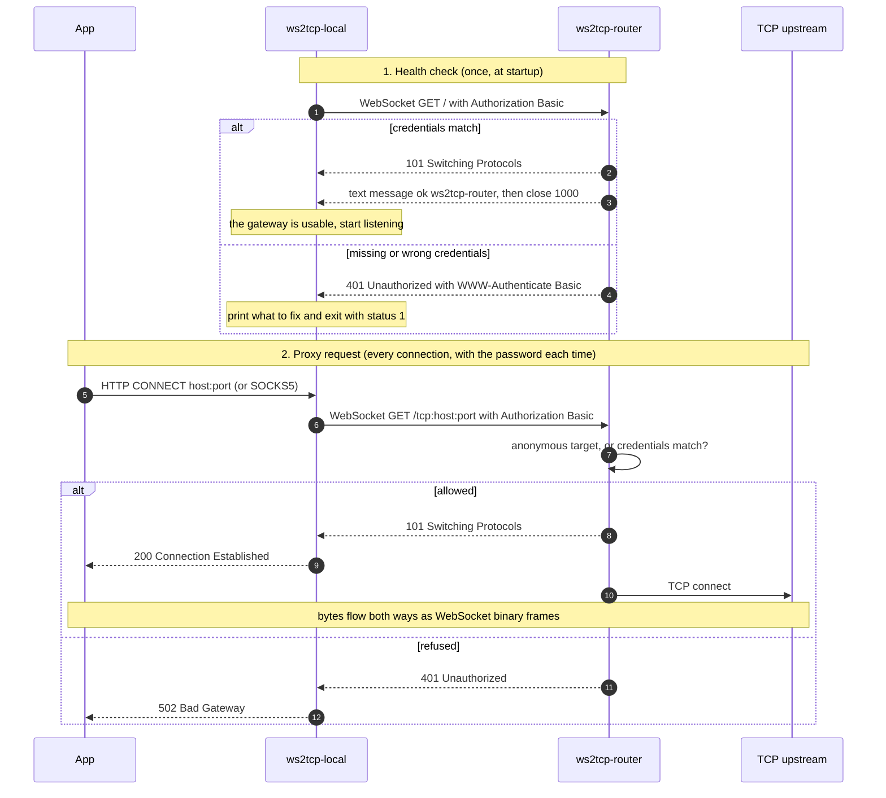
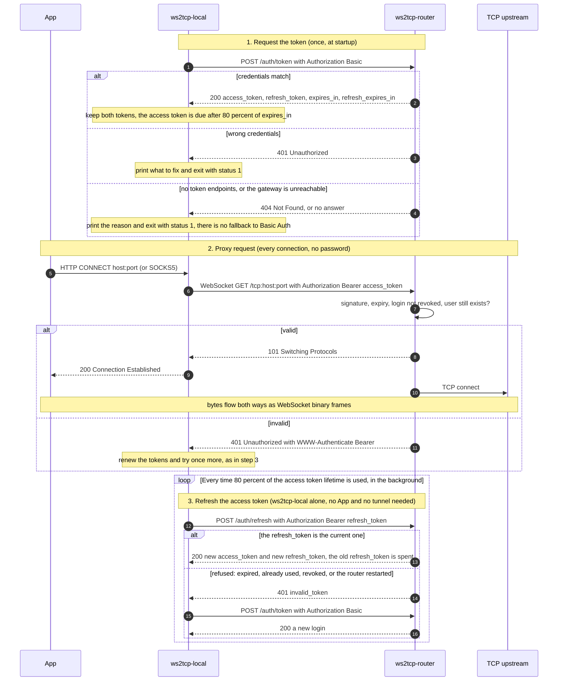
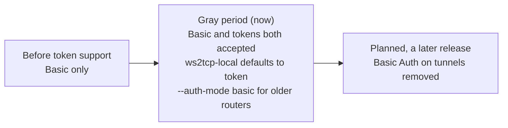
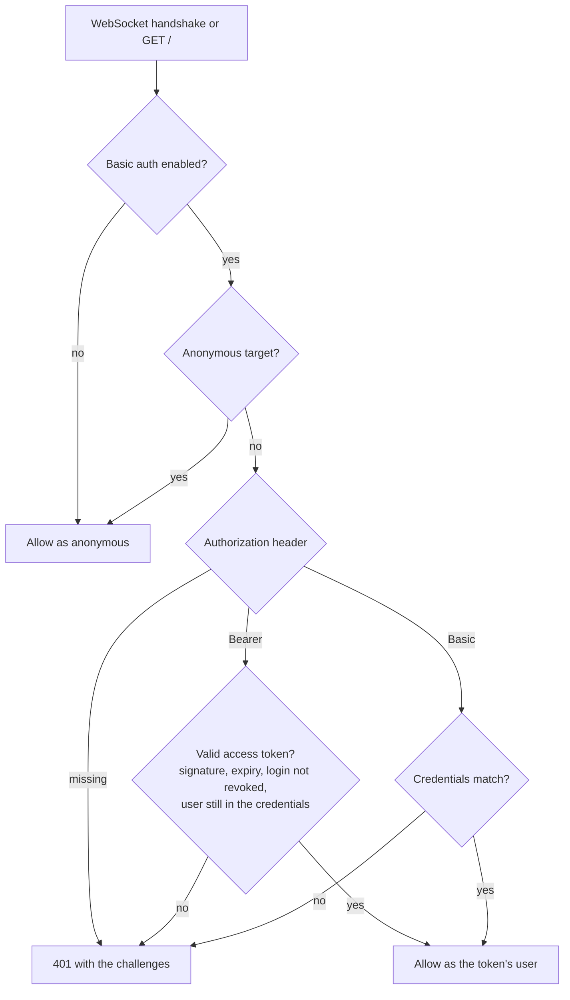
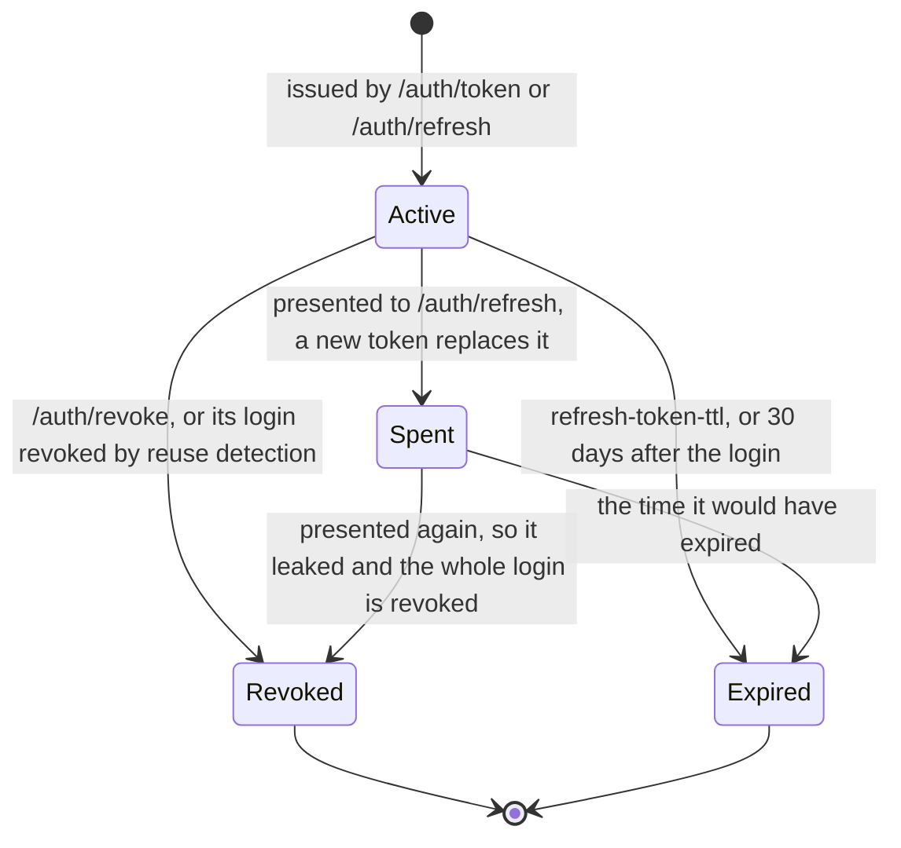
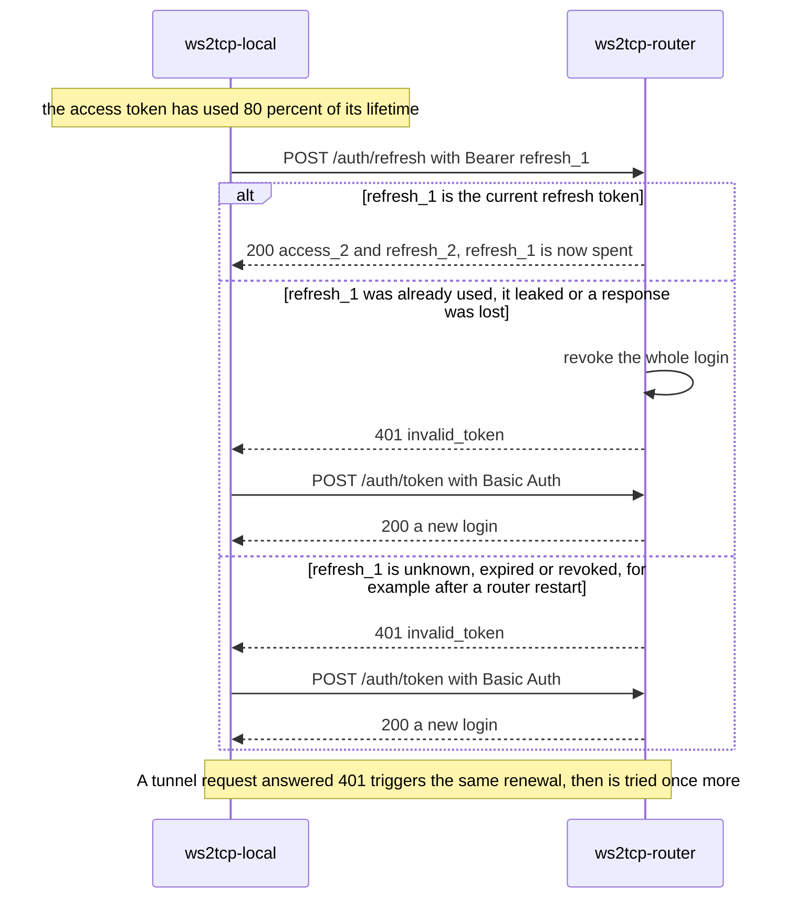
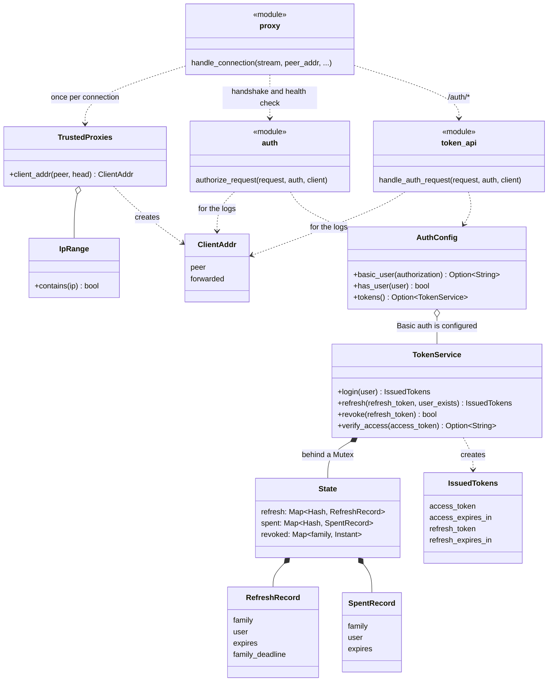
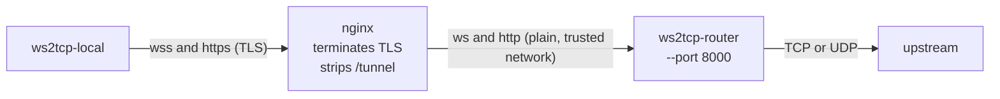
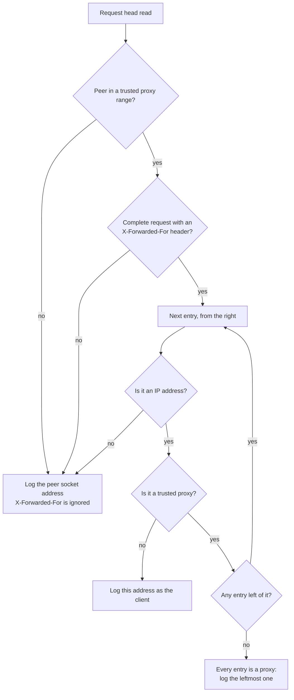

# ws2tcp-router

`ws2tcp-router` is a small Tokio-based proxy that accepts WebSocket connections and forwards each connection to a TCP or UDP upstream selected by the request path.

For example:

```text
ws://10.15.108.29:8000/tcp:116.63.8.64:12345
```

means:

- listen for a WebSocket connection on `10.15.108.29:8000`
- connect to TCP upstream `116.63.8.64:12345`
- forward WebSocket binary frames to TCP
- forward TCP bytes back as WebSocket binary frames

Text WebSocket frames are also accepted and forwarded to TCP as UTF-8 bytes.

Use `/udp:` instead of `/tcp:` to forward to a UDP upstream:

```text
ws://10.15.108.29:8000/udp:116.63.8.64:12345
```

Each WebSocket message is forwarded as one UDP datagram, and each UDP datagram
received back is forwarded as one WebSocket binary message, preserving
datagram boundaries. Since UDP has no connection teardown signal, the session
is closed after `--udp-idle-timeout` seconds without traffic in either
direction. See [UDP Forwarding](#udp-forwarding) below.

## Build

```bash
cargo build --release
```

## Docker

Published images are available from GitHub Container Registry:

```bash
podman pull ghcr.io/uglykitty/ws2tcp-router:0.2.1
podman run --rm -p 8000:8000 ghcr.io/uglykitty/ws2tcp-router:0.2.1
```

Build the image:

```bash
docker build -t ws2tcp-router .
```

Run with the default WS listener on port `80`:

```bash
docker run --rm -p 80:80 ws2tcp-router
```

Pass any CLI option after the image name:

```bash
docker run --rm -p 8000:8000 ws2tcp-router --bind 0.0.0.0 --port 8000
docker run --rm -p 8000:8000 -e RUST_LOG=ws2tcp_router=debug ws2tcp-router
docker run --rm -p 8000:8000 -v "$PWD/logs:/logs" ws2tcp-router --log-file /logs/ws2tcp-router.log
```

Docker images and GitHub Release binaries are published by GitHub Actions when
a version tag is pushed:

```bash
git tag v0.2.1
git push origin v0.2.1
```

The Release contains single-file executables:

- `ws2tcp-router-linux-x86_64`
- `ws2tcp-router-linux-arm64`
- `ws2tcp-router-windows-x86_64.exe`
- `ws2tcp-router-windows-arm64.exe`
- `ws2tcp-router-macos-x86_64`
- `ws2tcp-router-macos-arm64`

After the first publish, set the package visibility to public in GitHub if the
image should be pullable without authentication.

## Run

Bind on all interfaces and the default WS port `80`:

```bash
cargo run -- --bind ::
```

Bind on a non-privileged WS port:

```bash
cargo run -- --bind :: --port 8000
```

Load options from a TOML configuration file:

```bash
cargo run -- --config ./config.example.toml
```

Command-line options override values from the configuration file:

```bash
cargo run -- --config ./config.example.toml --bind 0.0.0.0 --port 9000
```

Bind on IPv6 only:

```bash
cargo run -- --bind :: --port 8000 --ipv6-only
```

Bind on a specific address:

```bash
cargo run -- --bind 10.15.108.29 --port 8000
cargo run -- --bind 2001:db8::10 --port 8000
```

Require HTTP Basic authentication:

```bash
cargo run -- --basic-auth alice:secret --basic-auth bob:secret2
```

Load HTTP Basic authentication credentials from a file:

```bash
cargo run -- --basic-auth-file ./users.txt
```

Then connect with a WebSocket client:

```text
ws://10.15.108.29:8000/tcp:116.63.8.64:12345
```

Serve WSS with a PEM certificate chain and private key:

```bash
cargo run -- --bind 0.0.0.0 --service-mode wss-only --tls-port 443 --tls-cert ./cert.pem --tls-key ./key.pem
```

Then connect with a secure WebSocket client:

```text
wss://10.15.108.29/tcp:116.63.8.64:12345
```

## Options

```text
--config <PATH>       Load options from a TOML configuration file.
--bind <ADDR>          Address to bind the WebSocket server to. Default: ::
--service-mode <MODE>  Service mode to run: ws-only, wss-only, or both. Default: ws-only
--port <PORT>          Port to bind the WS server to. Default: 80
--tls-port <PORT>      Port to bind the WSS server to. Default: 443
--ipv6-only            Only accept IPv6 connections when binding an IPv6 address.
--no-ipv6-only         Accept both IPv4 and IPv6 when binding an IPv6 address.
--buffer-size <BYTES>  TCP read buffer size. Default: 16384
--udp-idle-timeout <SECONDS>
                       Seconds of inactivity before an idle UDP forwarding
                       session is closed. Default: 60
--basic-auth <USER:PASS>
                       Require HTTP Basic authentication. Can be repeated.
--basic-auth-file <PATH>
                       Load HTTP Basic authentication credentials from a file.
--anonymous-target <HOST:PORT>
                       Allow anonymous access to this upstream target even when
                       Basic authentication is enabled. Can be repeated.
--anonymous-target-file <PATH>
                       Load anonymous upstream targets from a file.
--trusted-proxy <IP[/PREFIX]>
                       Believe X-Forwarded-For from connections that come from
                       this reverse proxy, and log the client address it reports.
                       An IP address or CIDR range. Can be repeated.
                       Default: 127.0.0.0/8 and ::1
--token-secret-file <PATH>
                       File holding the secret (at least 32 bytes) that signs
                       access tokens. A random secret is generated at startup
                       when omitted.
--access-token-ttl <SECONDS>
                       Lifetime of an access token. Default: 600
--refresh-token-ttl <SECONDS>
                       Lifetime of a refresh token. Default: 604800 (7 days)
--tls-cert <PATH>      PEM-encoded TLS certificate chain for serving WSS.
--tls-key <PATH>       PEM-encoded TLS private key for serving WSS.
--auto-self-signed-cert
                       Generate an in-memory 10-year self-signed certificate for WSS.
--no-auto-self-signed-cert
                       Disable automatic self-signed certificate generation from a config file.
--log-file <PATH>      Append logs to this file instead of standard error.
--log-level <FILTER>   Logging filter, overriding RUST_LOG. Example: ws2tcp_router=debug
```

When binding an IPv6 address without `--ipv6-only`, the listener allows dual-stack
operation where the operating system supports it. Use `--ipv6-only` to reject
IPv4-mapped connections. If a configuration file sets `ipv6-only = true`, use
`--no-ipv6-only` to override it from the command line.

## Configuration File

Use `--config <PATH>` to load options from a TOML configuration file. The file
uses the same kebab-case names as the long command-line options:

```toml
bind = "::"
service-mode = "ws-only"
port = 80
tls-port = 443
ipv6-only = false
buffer-size = 16384
udp-idle-timeout = 60

basic-auth = ["alice:secret", "bob:secret2"]
basic-auth-file = "./users.txt"
anonymous-target = ["ocs.wangguofang.net:8443"]
anonymous-target-file = "./anonymous-targets.txt"
trusted-proxy = ["127.0.0.1", "10.0.0.0/8"]
token-secret-file = "./token.key"
access-token-ttl = 600
refresh-token-ttl = 604800
tls-cert = "./cert.pem"
tls-key = "./key.pem"
auto-self-signed-cert = false
log-file = "./logs/ws2tcp-router.log"
log-level = "ws2tcp_router=info"
```

Every setting is optional. Missing settings use the same defaults as the CLI.
When both `--config` and command-line options are present, command-line options
take precedence. See `config.example.toml` for a complete commented example.

Logging is controlled with `RUST_LOG`:

```bash
RUST_LOG=ws2tcp_router=debug cargo run -- --bind :: --port 8000
```

Use `--log-level` to set the same filter from the command line:

```bash
cargo run -- --bind :: --port 8000 --log-level ws2tcp_router=debug
```

By default logs are written to standard error. Use `--log-file` to append logs
to a file instead:

```bash
cargo run -- --bind :: --port 8000 --log-file ./logs/ws2tcp-router.log
```

## HTTP Basic Authentication

> **Kept for compatibility.** Basic Auth on every connection is being phased out in favor of
> [token authentication](#token-authentication), and is only retained while clients move over
> (see [Migrating from Basic Auth](#migrating-from-basic-auth)). Basic credentials remain the
> way to log in for a token for now.

Authentication is disabled unless `--basic-auth` or `--basic-auth-file` is
specified. When either option is used, every WebSocket upgrade request must
include a matching HTTP Basic `Authorization` header.

`--basic-auth` accepts one `USER:PASS` credential and can be repeated:

```bash
cargo run -- --basic-auth alice:secret --basic-auth bob:secret2
```

`--anonymous-target` allows selected upstream targets to skip Basic
authentication. It accepts one `HOST:PORT` target and can be repeated:

```bash
cargo run -- --basic-auth alice:secret --anonymous-target ocs.wangguofang.net:8443
```

The request path must match the configured target exactly after target
normalization. For example, the command above allows anonymous access to:

```text
ws://10.15.108.29:8000/tcp:ocs.wangguofang.net:8443
```

IPv6 targets must use bracket notation, such as `[2001:db8::1]:443`.

`--anonymous-target-file` reads one `HOST:PORT` target per line. Empty lines and
lines beginning with `#` are ignored:

```text
# anonymous-targets.txt
ocs.wangguofang.net:8443
[2001:db8::1]:443
```

Targets from the file are combined with any repeated `--anonymous-target`
options. The file is checked once per second and reloaded without restarting
the service. If it cannot be read or contains an invalid target, the service
keeps using the last valid targets and logs a warning.

`--basic-auth-file` reads one `USER:PASS` credential per line. Empty lines and
lines beginning with `#` are ignored:

```text
# users.txt
alice:secret
bob:secret2
```

The file is checked once per second and reloaded without restarting the
service. If a changed file cannot be read, contains an invalid credential, or
contains no credentials (unless `--basic-auth` also supplies one), the service
keeps using the last valid credentials and logs a warning.

Basic authentication does not encrypt credentials. Use it behind TLS when
serving untrusted networks.

### Basic Auth flow

With `ws2tcp-local --auth-mode basic` (the compatibility mode), the client checks the gateway
once at startup, then sends the credentials with every proxied connection:



## Token Authentication

With HTTP Basic authentication alone, the password travels with every WebSocket
handshake. Token authentication lets a client log in once with Basic Auth and open
tunnels with a short-lived **access token** instead, renewed with a long-lived
**refresh token**:

```bash
cargo run -- --bind 127.0.0.1 --port 8000 --basic-auth alice:secret
```

Token authentication is always on when Basic authentication (`--basic-auth` or
`--basic-auth-file`) is configured, because Basic credentials are how clients log in for a
token. There is no switch: a proxy request may carry either a Bearer access token or Basic
Auth, and both are accepted side by side. Basic Auth is kept for compatibility while clients
move to tokens. Without any credentials, authentication is off altogether and there are no
token endpoints.

The router does not check whether a connection is encrypted, so token authentication
works on the plain `ws://` listener and behind a reverse proxy that terminates TLS
(see [Behind a Reverse Proxy](#behind-a-reverse-proxy)). Over any unencrypted hop a token can be sniffed, just
like a Basic Auth header, and a refresh token is worth more than a password because
it keeps working: encrypt every hop that crosses an untrusted network.

### Overview

With `ws2tcp-local`'s default `token` mode, a client requests a token once and opens each tunnel
with the access token. It renews the access token with the refresh token on its own, in the
background, before it runs out: the application that uses the proxy takes no part in it and
does not notice. There is no fallback to Basic Auth.



### Migrating from Basic Auth

Basic Auth on tunnels is being phased out, and this is a gradual rollout: both methods work
side by side, and there is no setting to choose between them.



1. **Now, the gray period.** A router with Basic credentials accepts both. `ws2tcp-local`
   defaults to `--auth-mode token`, so it uses tokens; `--auth-mode basic` keeps the old
   behavior, for a router that has no token authentication (an older `ws2tcp-router`) and
   for clients that have not been updated. Both kinds of client work against this router.
2. **Later:** once no client uses Basic Auth any more, a later release removes Basic Auth on
   tunnels. Logging in for a token still takes the credentials (`--basic-auth` /
   `--basic-auth-file`) for now.

Until then Basic Auth cannot be switched off by configuration, and the router does not yet
log which method a connection used, so it cannot tell you when the last Basic client is gone.

### Endpoints

All three are plain HTTP `POST` requests with no body; the credential is in the
`Authorization` header.

| Request | Credential | Result |
| --- | --- | --- |
| `POST /auth/token` | `Basic <user:pass>` | a new access + refresh token |
| `POST /auth/refresh` | `Bearer <refresh token>` | a new pair; the presented refresh token is void |
| `POST /auth/revoke` | `Bearer <refresh token>` | logs out; `204 No Content` |

```bash
curl -sk -X POST -u alice:secret https://10.15.108.29/auth/token
```

```json
{"token_type":"Bearer","access_token":"...","expires_in":600,
 "refresh_token":"...","refresh_expires_in":604800}
```

Then open tunnels with the access token, in the header of the WebSocket handshake:

```text
Authorization: Bearer <access_token>
```

A rejected token gets `401 Unauthorized` with a `WWW-Authenticate: Bearer` challenge
(and `error="invalid_token"` when a token was presented).

### How a request is authorized

This is the decision for a WebSocket handshake, and for the plain `GET /` health
check (the `/auth/*` endpoints check their own credential, see the table above):



The `401` offers both a `Basic` and a `Bearer` challenge.

### Token lifetimes

Each refresh token moves through these states:



And this is how a client renews, or recovers when the router no longer knows its
refresh token:



### How it behaves

- An **access token** is stateless and signed (HMAC-SHA256). The server keeps nothing
  per access token, only checking the signature, the expiry, that its login was not
  revoked, and that its user still exists. Removing a user from the credentials
  therefore ends their tokens (access tokens within their remaining lifetime, refresh
  tokens at once).
- A **refresh token** is random, opaque and single-use: each refresh returns a new one
  and voids the old one. Only its SHA-256 is stored. Presenting one that was already
  used means it leaked, so the whole login (its refresh token and, until they expire,
  its access tokens) is revoked and the client has to log in again with Basic Auth.
  A refresh token also stops working 30 days after the login however often it is
  renewed.
- Tunnels that are already open are not closed when their access token expires or is
  revoked: the token is checked at the handshake only.
- Refresh tokens live in memory. After a restart they are gone and clients log in
  again with Basic Auth (`ws2tcp-local` does this by itself). Access tokens survive
  a restart only when `--token-secret-file` is set; without it a random secret is
  generated each time. Run one router per secret file: refresh tokens are not shared
  between instances.
- `ws2tcp-local --auth-mode token` (through `ws2tcp-local-core`) logs in at startup, renews
  the access token before it runs out, logs in again when the router
  forgot its refresh token, and never falls back to Basic Auth. With
  `--auth-mode basic` it does not use tokens at all. Clients without token support keep
  working: Basic Auth is still accepted.

There is no rate limiting on login attempts yet, on the token endpoints or on the
WebSocket handshake alike.

### Internals



## TLS / WSS

TLS is disabled by default. Configure both `--tls-cert` and `--tls-key` to serve
secure WebSocket connections with `wss://`:

```bash
cargo run -- --service-mode wss-only --tls-cert ./cert.pem --tls-key ./key.pem
```

`--tls-cert` must point to a PEM certificate chain, and `--tls-key` must point to
a PEM private key. Configure clients to trust the certificate authority that
issued the certificate, or use a publicly trusted certificate for public
deployments.

For local or controlled deployments, `--auto-self-signed-cert` generates an
in-memory self-signed certificate that is valid for 10 years. The certificate SAN
list includes the server's current IPv4 and IPv6 addresses. This option cannot
be used together with `--tls-cert` or `--tls-key`:

```bash
cargo run -- --service-mode wss-only --auto-self-signed-cert
```

Run both WS and WSS listeners at the same time:

```bash
cargo run -- --service-mode both --port 80 --tls-port 443 --auto-self-signed-cert
```

## Behind a Reverse Proxy

The router can sit behind a reverse proxy such as nginx that terminates TLS and speaks
plain `ws://` to the router:



```nginx
map $http_upgrade $connection_upgrade {
    default upgrade;
    ''      close;
}

server {
    listen 443 ssl;
    server_name wangguofang.net;
    # ssl_certificate and ssl_certificate_key go here

    location /tunnel/ {
        proxy_pass http://127.0.0.1:8000/;   # the trailing slash strips /tunnel
        proxy_http_version 1.1;
        proxy_set_header Upgrade $http_upgrade;
        proxy_set_header Connection $connection_upgrade;
        proxy_set_header Host $host;
        proxy_set_header X-Forwarded-For $proxy_add_x_forwarded_for;
        proxy_read_timeout 1h;               # the default of 60 s closes idle tunnels
    }
}
```

The gateway is then `wss://wangguofang.net/tunnel`. The proxy has to forward the
WebSocket upgrade **and** the plain HTTP requests under the same path prefix: the
health check (`GET /tunnel/`) and, with [token authentication](#token-authentication),
`POST /tunnel/auth/token` and `POST /tunnel/auth/refresh`, which the router receives as
`POST /auth/token` and so on. The `Authorization` header is passed through.

### Client addresses

Every connection arrives from the proxy, so without help the logs would show the proxy's
address for every client. The router reads the client's address from `X-Forwarded-For`
(nginx does not send it unless it is told to, as in the `proxy_set_header` line above),
and logs it in the `peer` field of the log lines about that connection:

```text
DEBUG http health check peer=203.0.113.7 user=alice UA=ws2tcp-local/0.1.20
```

Any client can send an `X-Forwarded-For` header of its own, so the router believes it
**only when the connection comes from a trusted proxy**, and then only what the trusted
proxies wrote: it reads the entries from the right, skips the addresses of trusted
proxies, and takes the first other address as the client. Entries that the client put
to the left of that cannot change the outcome.



With `--trusted-proxy` (an IP address or a CIDR range such as `10.0.0.0/8`; repeat it for
several) you say which proxies are trusted. The default is the loopback addresses
(`127.0.0.0/8` and `::1`), which covers an nginx on the same host without any
configuration; for an nginx on another host or in another container, name its address.
Giving `--trusted-proxy` replaces the default, and `trusted-proxy = []` in the
configuration file trusts nobody, so the header is never read. The trusted proxies are
logged at startup.

Notes:

- Only the logs use the address. Nothing else in the router depends on where a client
  comes from.
- A client address from `X-Forwarded-For` has no port, so it is logged without one
  (`203.0.113.7`); a connection that is not from a trusted proxy is logged as before
  (`127.0.0.1:43026`). The addresses in a header may carry a port or IPv6 brackets;
  IPv4-mapped IPv6 addresses are logged as IPv4.
- The `connection closed with error` line is written without having read a request, so
  it still shows the address of whoever connected: the proxy.

## Path Format

The request path must be:

```text
/tcp:<host>:<port>
/udp:<host>:<port>
```

IPv6 upstream addresses must be enclosed in brackets:

```text
/tcp:[<ipv6-address>]:<port>
/udp:[<ipv6-address>]:<port>
```

Examples:

```text
/tcp:116.63.8.64:12345
/tcp:example.com:80
/tcp:[2001:db8::1]:443
/udp:116.63.8.64:12345
/udp:[2001:db8::1]:53
```

`--anonymous-target` and `--anonymous-target-file` match by `host:port` only,
regardless of protocol: allowing `ocs.wangguofang.net:8443` permits anonymous
access to both `/tcp:ocs.wangguofang.net:8443` and
`/udp:ocs.wangguofang.net:8443`.

### Health check

A request to the root path `/` does not connect to any upstream, so a client can
use it to verify that the service is reachable before opening a real connection.
The server tells the client what happened, in one of two ways:

- **WebSocket** (`ws://10.15.108.29:8000/`): the handshake succeeds, the server
  sends a text message, then a close frame with code `1000` (normal closure) and
  reason `health check`.
- **Plain HTTP** (`curl http://10.15.108.29:8000/`, or `https://` when serving
  WSS): the server replies `200 OK` with the same text as a `text/plain` body.
  `HEAD /` returns the headers only.

The text message looks like this:

```text
ok: ws2tcp-router 0.2.1 is available; health check only, no upstream connected
```

The health check hands out nothing else. Earlier versions returned an unverified
`X-Ws2tcp-Token` header; it was replaced by the real
[token authentication](#token-authentication) below, and clients that still send
that header are simply ignored.

When Basic Auth is enabled, the health check still requires valid credentials,
because `/` is not an anonymous target: without them, both forms fail with
`401 Unauthorized`. It accepts Basic Auth as well as access tokens, so clients in `basic`
mode and monitoring probes keep working.

A WebSocket request with a path that is not `/`, `/tcp:` or `/udp:` is rejected
with `400 Bad Request` and a body explaining the expected path format. Plain
HTTP requests to any other path are still closed without a response.

## UDP Forwarding

Connect with a `/udp:` path to forward to a UDP upstream instead of TCP:

```bash
cargo run -- --bind :: --port 8000
```

```text
ws://10.15.108.29:8000/udp:116.63.8.64:12345
```

Each WebSocket message is forwarded as exactly one UDP datagram to the
upstream, and each UDP datagram received from the upstream is forwarded back
as exactly one WebSocket binary message. Datagram boundaries are preserved in
both directions; unlike the TCP path, message contents are never split or
coalesced.

UDP has no connection or close signal, so the proxy cannot detect when a
upstream is done responding. Instead, the forwarding session for a WebSocket
connection is closed after `--udp-idle-timeout` seconds pass with no traffic
in either direction:

```bash
cargo run -- --bind :: --port 8000 --udp-idle-timeout 30
```

The default is 60 seconds. As with any UDP forwarding, delivery, ordering, and
retransmission are the responsibility of the client and upstream; the proxy
does not add reliability on top of UDP.
